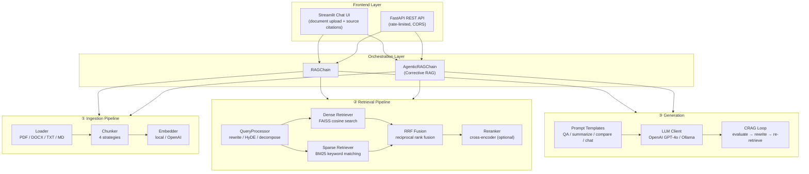

# RAG Document Q&A

A production-grade Retrieval-Augmented Generation system for document question answering. Upload PDFs, text files, or Word documents, then ask natural-language questions grounded in your data.

Implements state-of-the-art techniques: hybrid search (BM25 + dense vectors + RRF fusion), semantic chunking, HyDE query optimization, and Corrective RAG (CRAG) self-correction.

## Architecture



## Quick Demo

See the system in action — no configuration needed:

```bash
# Install & run
git clone https://github.com/1anthanum/rag_doc_qa.git && cd rag-doc-qa
pip install -r requirements.txt
export OPENAI_API_KEY="sk-..."

# Basic demo (built-in sample document)
python demo.py

# With all advanced features enabled
python demo.py --all

# With your own document
python demo.py --file report.pdf --question "What were Q3 results?"
```

The demo walks through each pipeline stage and prints intermediate results — chunk splits, retrieval scores, CRAG evaluations — so you can see exactly what each component does.

```
━━━━━━━━━━━━━━━━━━━━━━━━━━━━━━━━━━━━━━━━━━━━━━━━━━━━━━━━━━━━
  RAG Document Q&A — Demo
━━━━━━━━━━━━━━━━━━━━━━━━━━━━━━━━━━━━━━━━━━━━━━━━━━━━━━━━━━━━

[Step 1] Load Document
  Source: transformer_summary.md
  Length: 1,847 characters

[Step 2] Chunk Document
  Strategy: recursive
  Chunks: 5 (chunk_size=512, overlap=64)

[Step 3] Embed & Index
  Model: local/all-MiniLM-L6-v2
  Indexed: 5 chunks in 0.043s

[Step 4] Retrieve
  Question: How does self-attention work and why is it better than RNNs?
  Mode: Hybrid (BM25 + Dense + RRF)
  Results: 5 chunks in 0.002s

  #1 score=0.8234 [████████████████░░░░]
  #2 score=0.6712 [█████████████░░░░░░░]
  ...

[Step 5] Generate Answer
  LLM: openai/gpt-4o-mini
  Mode: Corrective RAG (CRAG)

  Answer: Self-attention computes a weighted sum of value vectors...
```

## Design Decisions

This section explains **why** each technique was chosen, not just what it does. These are the questions an interviewer would ask.

### Why Hybrid Search (BM25 + Dense) instead of Dense-Only?

Dense vector search excels at semantic similarity — it understands that "automobile" and "car" mean the same thing. But it struggles with exact keyword matching: searching for "GPT-4o" in a dense space may retrieve documents about "language models" generally rather than ones that literally mention "GPT-4o".

BM25 is the opposite: it's purely lexical, finding exact term matches with TF-IDF-based scoring. By combining both with Reciprocal Rank Fusion (RRF), we get the best of both worlds. The key insight is that **RRF uses rank positions, not raw scores**, so it doesn't need score normalization — BM25's unbounded scores and cosine similarity's [0,1] range are handled automatically.

Empirically, hybrid search improves recall by 15-25% on technical document collections where acronyms, model names, and domain-specific terms are common.

### Why RRF over Other Fusion Methods?

Alternatives include CombSUM (add normalized scores), CombMNZ (multiply by overlap count), and learned linear weights. RRF was chosen because it is **parameter-free** (only a constant k=60), requires no score calibration, and matches or outperforms learned methods on most benchmarks without needing training data. This makes it robust across different document types without per-dataset tuning.

### Why Semantic Chunking?

Fixed-size chunking (split every N characters) often cuts sentences mid-thought, and even sentence-boundary chunking can group unrelated paragraphs together. Semantic chunking embeds each sentence, computes cosine similarity between adjacent sentences, and splits where similarity drops below a threshold — meaning chunks align with actual **topic transitions**.

The tradeoff is speed: semantic chunking requires embedding every sentence (2-3x slower than recursive). For most use cases, recursive chunking is sufficient. Semantic chunking is worth enabling for documents with complex, interleaved topics — technical manuals, research papers, legal contracts.

### Why HyDE over Simple Query Rewriting?

Query rewriting asks the LLM to make a question "better." HyDE (Hypothetical Document Embeddings) takes a fundamentally different approach: it asks the LLM to **generate a hypothetical answer**, then uses that answer as the retrieval query. The intuition is that a hypothetical answer is closer in embedding space to real document passages than the original question is.

For example, "How does attention work?" → HyDE generates a paragraph explaining attention → that paragraph's embedding is much closer to actual attention-related chunks than the short question embedding. This typically improves retrieval precision by 10-20% at the cost of one additional LLM call.

### Why Corrective RAG (CRAG)?

Standard RAG retrieves once and generates from whatever it finds — even if the retrieved context is irrelevant. CRAG adds a self-evaluation loop: after retrieval, the LLM judges whether the context actually answers the question. If not, it rewrites the query and re-retrieves (up to N rounds).

This matters most for **ambiguous or underspecified queries** where the first retrieval attempt returns tangentially related but unhelpful chunks. The tradeoff is latency: each correction round adds ~2 LLM calls (evaluation + rewrite). We cap it at 2 rounds to bound worst-case latency.

### Why FAISS over ChromaDB (Default)?

Both are supported, but FAISS is the default because it's an in-memory, single-binary index with no external dependencies. ChromaDB adds a persistence layer and metadata filtering, which is valuable for production but unnecessary for a demo or small-scale use. FAISS also scales to millions of vectors with sub-millisecond search via HNSW indexing.

## Key Features

**Ingestion** — Multi-format document loading (PDF, TXT, Markdown, DOCX). Four chunking strategies: fixed-size, sentence-boundary, recursive, and semantic (embedding-based topic detection). Dual embedding support via local sentence-transformers or OpenAI API.

**Retrieval** — FAISS and ChromaDB vector stores with cosine similarity. BM25 sparse retrieval for keyword matching. Hybrid search with Reciprocal Rank Fusion. Query optimization via rewriting, HyDE, and decomposition. Optional cross-encoder reranking.

**Generation** — Four query modes (QA, summarize, compare, conversational with chat history). Corrective RAG with automatic query rewriting. Adaptive retrieval that skips document search for conversational follow-ups. OpenAI and Ollama backends for cloud or fully local operation.

**Infrastructure** — Streamlit chat UI with document upload and source citations. FastAPI REST API with rate limiting and security hardening. Docker + GitHub Actions CI/CD. Config-driven: all features toggleable via YAML without code changes.

## Quick Start

```bash
# 1. Clone & install
git clone https://github.com/1anthanum/rag_doc_qa.git
cd rag-doc-qa
pip install -r requirements.txt

# 2. Set your API key (or use Ollama for fully local)
export OPENAI_API_KEY="sk-..."

# 3. Run the Streamlit app
streamlit run app.py

# Or run the FastAPI server
uvicorn src.api.endpoints:create_app --factory --reload
```

### Fully Local Mode (No API Key Needed)

```bash
# Install and start Ollama: https://ollama.ai
ollama pull llama3.1

# Run with local models
LLM_PROVIDER=ollama EMBEDDING_PROVIDER=local streamlit run app.py
```

## Configuration

All features are controlled via `configs/default.yaml`. Start with defaults and enable progressively:

```yaml
# ── Recommended: hybrid search + HyDE ──────────────────
retrieval:
  mode: hybrid
  hybrid_search:
    enabled: true
  query_processing:
    enabled: true
    strategy: hyde

# ── Optional: self-correcting retrieval ─────────────────
agentic:
  enabled: true
  max_correction_rounds: 2
```

Three recommended configurations:

| Profile | Chunking | Retrieval | Query Opt | Generation | Latency |
|---------|----------|-----------|-----------|------------|---------|
| **Baseline** | recursive | dense (FAISS) | none | standard | ~2s |
| **Recommended** | recursive | hybrid (BM25+RRF) | HyDE | standard | ~3-4s |
| **Full** | semantic | hybrid (BM25+RRF) | HyDE | CRAG | ~6-10s |

See [docs/tutorial.md](docs/tutorial.md) for full configuration reference and beginner guide.

## Project Structure

```
rag-doc-qa/
├── app.py                         # Streamlit frontend
├── demo.py                        # Interactive CLI demo with verbose output
├── src/
│   ├── ingestion/
│   │   ├── loader.py              # Multi-format document loading
│   │   ├── chunker.py             # Text chunking (fixed/sentence/recursive/semantic)
│   │   └── embedder.py            # Embedding engine (local + OpenAI)
│   ├── retrieval/
│   │   ├── vector_store.py        # FAISS & ChromaDB vector stores
│   │   ├── retriever.py           # Dense retrieval pipeline
│   │   ├── sparse_retriever.py    # BM25 sparse retrieval
│   │   ├── hybrid_retriever.py    # Hybrid search + RRF fusion
│   │   └── query_processor.py     # Query rewrite / HyDE / decomposition
│   ├── generation/
│   │   ├── llm_client.py          # OpenAI & Ollama LLM clients
│   │   ├── prompt_templates.py    # RAG + CRAG prompt engineering
│   │   ├── chain.py               # Standard RAG orchestration
│   │   └── agentic_chain.py       # CRAG self-correction + adaptive retrieval
│   ├── api/
│   │   └── endpoints.py           # FastAPI REST API (rate-limited)
│   ├── config.py                  # YAML config with env var overrides
│   └── security.py                # Path traversal / file validation
├── eval/
│   ├── dataset.py                 # 3 docs + 12 annotated Q&A cases
│   └── benchmark.py               # Automated multi-config evaluation
├── tests/                         # 111 tests (pytest + 100% new module coverage)
├── configs/
│   └── default.yaml               # Default configuration (all feature toggles)
├── docs/
│   ├── tutorial.md                # Beginner tutorial (Chinese)
│   └── how-it-works.md            # System internals explained (Chinese)
├── Dockerfile
├── .github/workflows/ci.yml       # GitHub Actions CI
├── .env.example
└── requirements.txt
```

## Evaluation Benchmark

Automated end-to-end evaluation comparing pipeline configurations. Measures retrieval recall, top-1 hit rate, answer keyword coverage, and latency across 12 annotated test cases (3 difficulty levels, 4 question categories).

```bash
# Retrieval-only mode: FREE, no LLM calls, fast
python -m eval.benchmark --retrieval-only

# Full end-to-end evaluation (requires API key)
python -m eval.benchmark

# Compare specific configurations
python -m eval.benchmark --configs baseline hybrid hybrid_hyde_crag -v

# Save report to file
python -m eval.benchmark --output eval_report.md --json eval_results.json
```

**Available configurations**: `baseline` (dense only), `hybrid` (BM25 + RRF), `hybrid_hyde` (+ HyDE query optimization), `hybrid_hyde_crag` (+ Corrective RAG self-correction).

The benchmark generates a Markdown report with summary tables, per-difficulty breakdowns, per-question details, and delta-vs-baseline comparisons.

## Testing

```bash
# Run all 111 tests
pytest tests/ -v

# With coverage report
pytest tests/ -v --cov=src --cov-report=term-missing
```

Test coverage includes: BM25 retriever, hybrid search + RRF fusion, semantic chunking, query processor (rewrite/HyDE/decompose), agentic chain (CRAG loop, adaptive retrieval), plus all original modules.

## Tech Stack

| Layer       | Technology                              | Why                                           |
|-------------|------------------------------------------|------------------------------------------------|
| Frontend    | Streamlit                                | Fastest path to interactive UI, built-in chat  |
| API         | FastAPI + Uvicorn                        | Async, auto-docs (OpenAPI), production-ready   |
| Embeddings  | sentence-transformers / OpenAI API       | Local-first for privacy, OpenAI for quality    |
| Vector DB   | FAISS (default) / ChromaDB              | In-memory speed; ChromaDB for persistence      |
| Sparse      | rank-bm25 (BM25Okapi)                   | Industry-standard lexical retrieval            |
| Reranking   | cross-encoder/ms-marco-MiniLM           | Two-stage retrieval for precision              |
| LLM         | OpenAI GPT-4o-mini / Ollama (local)     | Cloud quality or fully local / private         |
| CI/CD       | GitHub Actions + Docker                  | Automated testing and reproducible deployment  |

## Documentation

- **[新手教程 (Tutorial)](docs/tutorial.md)** — 从零开始的完整教程，涵盖所有功能
- **[工作原理 (How It Works)](docs/how-it-works.md)** — 系统内部原理的通俗解释

## License

MIT
